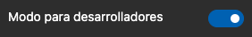
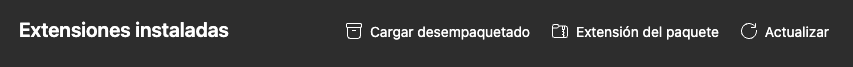

1. Go to your browsers's extensions management page and enable the developer mode
   
2. Load the unpacked extension by selectiong this project's root
   
   This will tell the browsers, with the [manifest](./manifest.json), how to load the extension
3. Open a pull request file changes to see PNGs diff